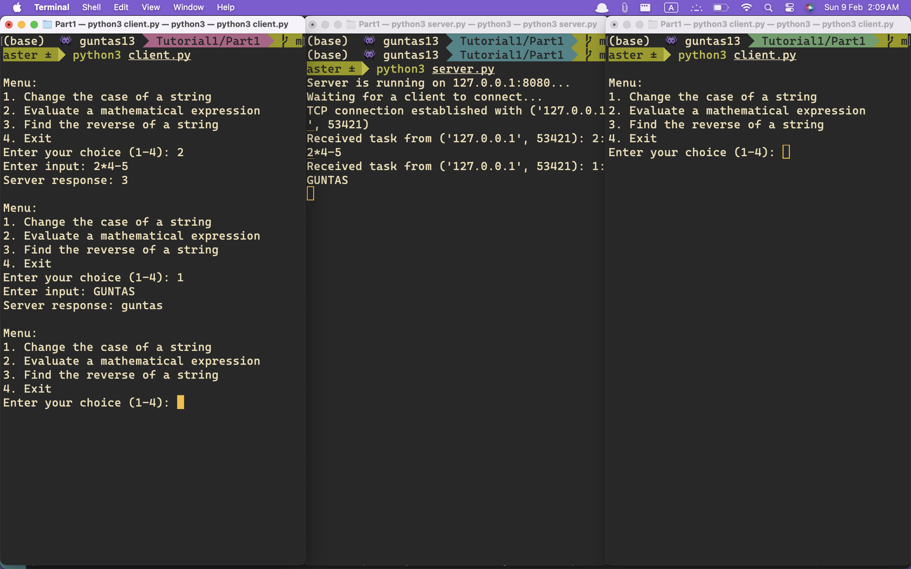
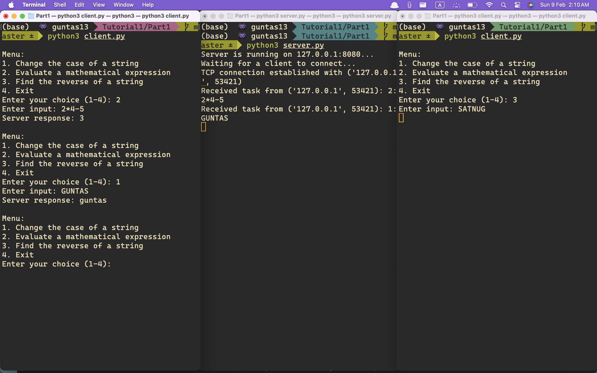
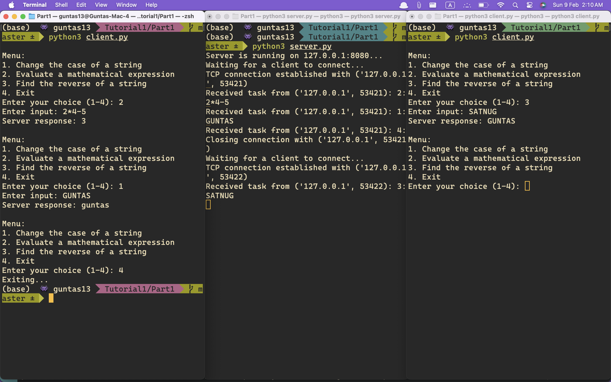
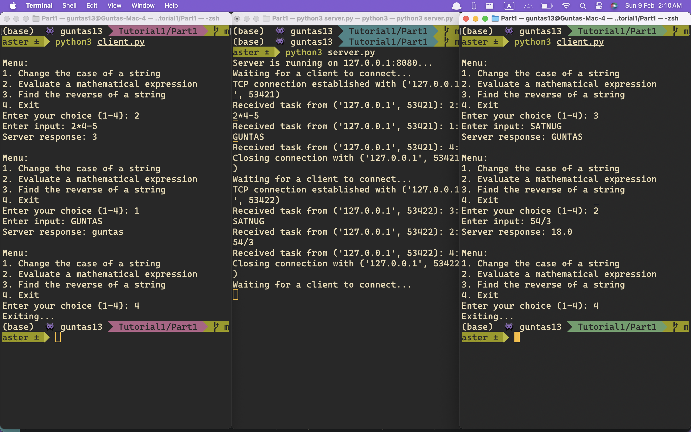
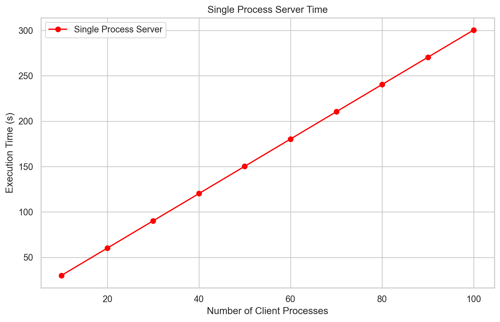
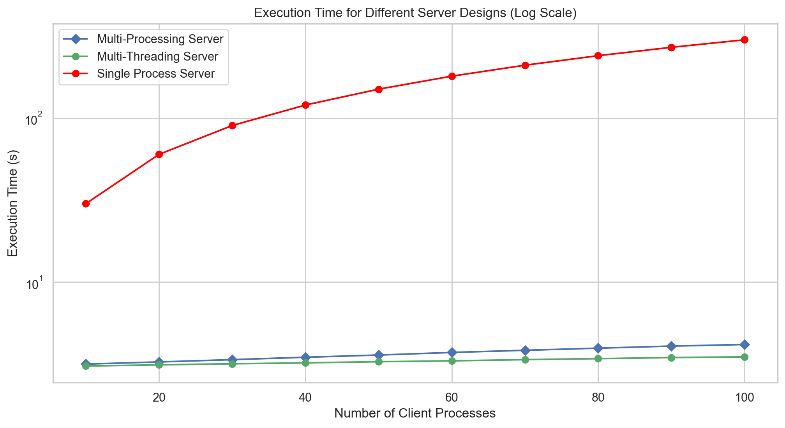
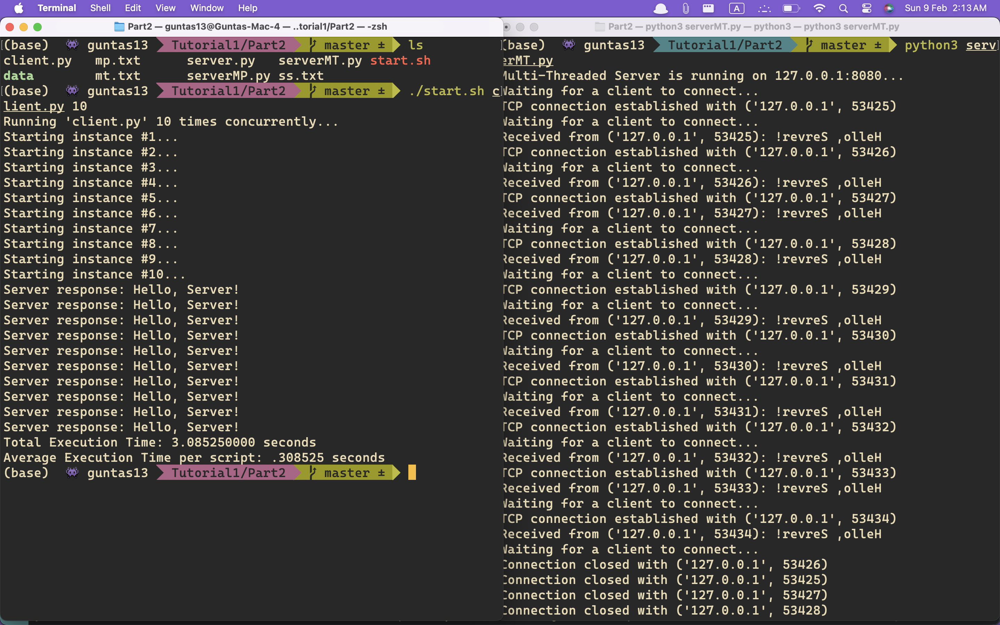

# CS331 Tutorial1

# Server-Client Socket Programming

# Part1

Basic Idea was to create two infinite loops - the outer loop waiting for a queue connection to a client to accept and when accepted then it enters the inner loop and caters to the requests of the connected client - rest stay in queue.

```python
server_socket = socket.socket(socket.AF_INET, socket.SOCK_STREAM)
server_socket.bind((HOST, PORT))
server_socket.listen(100)

print(f"Server is running on {HOST}:{PORT}...")

try:
    while True:
        print("Waiting for a client to connect...")
        conn, addr = server_socket.accept()
        print(f"TCP connection established with {addr}")

        while True:
            try:
                data = conn.recv(1024).decode()
                if not data:
                    print(f"Client {addr} disconnected.")
                    break

                print(f"Received task from {addr}: {data}")
                response = process_task(data)

                conn.sendall(response.encode())

                if response == "Goodbye!":
                    print(f"Closing connection with {addr}")
                    break

            except Exception as e:
                print(f"Error handling client {addr}: {e}")
                break

        conn.close()
```

<div align = "center">
    
</div>

<div align = "center">
<i><b>Fig1</b>: Only 1 Client Connected, the other is still waiting.</i>
</div>

<div align = "center">
    
</div>

<div align = "center">
<i><b>Fig2</b>: Server catering to client 1, the other is still waiting.</i>
</div>

<div align = "center">
    
</div>

<div align = "center">
<i><b>Fig3</b>: As soon as the first client disconnects, the request of the second is served by connecting.</i>
</div>

<div align = "center">
    
</div>

<div align = "center">
<i><b>Fig4</b>: All existing clients' connection/socket closed and the server is still waiting for serving more client.</i>
</div>

# Part2

For Part2, change the directory to `Part2`

```bash
cd Part2
```

## Start the different Server Designs

### Single-Process Server

```bash
python3 server.py
```

### Multi-Process Server

```bash
python3 serverMP.py
```

### Multi-Threaded Server

```bash
python3 serverMT.py
```

## Benchmarking - Running the Client Program
For Multi-Processing and Multi-Threaded Server designs, I ran the script for each `client_number=[10,20...100]` for **3 times** and then took the **median** as the final reporting value.

```bash
chmod +x start.sh
./start.sh client.py <number-of-client-processes>
```

## Results

### Single-Process Server

```bash
10  -> 30.107380s
20  -> 60.168934s
30  -> 90.212209s
40  -> 120.242131s
50  -> 150.286684s
60  -> 180.355433s
70  -> 210.392723s
80  -> 240.437711s
90  -> 270.443304s
100 -> 300.446261s
```

### Multi-Process Server

```bash
Run1 -> 3.165042 3.265307 3.366160 3.463547 3.593423 3.704624 3.814901 3.920916 4.030464 4.150824
Run2 -> 3.158274 3.262588 3.371035 3.498016 3.613633 3.741437 3.857643 3.965433 4.075619 4.166602
Run2 -> 3.164919 3.261594 3.369247 3.484277 3.594287 3.727424 3.841962 3.958121 4.079759 4.203419
```

### Multi-Threaded Server

```bash
Run1 -> 3.079222 3.131812 3.173668 3.209009 3.273532 3.309823 3.373803 3.407952 3.460488 3.498707
Run2 -> 3.091435 3.140113 3.184711 3.220513 3.264540 3.312111 3.370179 3.416331 3.470950 3.524193
Run3 -> 3.077185 3.125844 3.179028 3.221829 3.275605 3.319528 3.365879 3.421557 3.469652 3.502062
```

<div align = "center">
    
</div>

<div align = "center">
    
</div>

<div align = "center">
    
</div>

<div align = "center">
    
</div>

<div align = "center">
<i>Demonstration of the test running process.</i>
</div>
